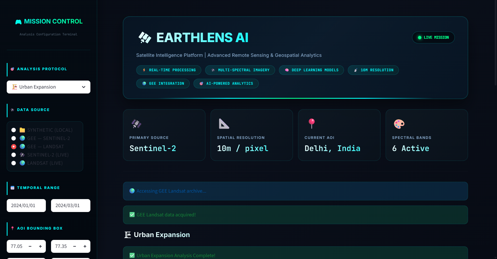
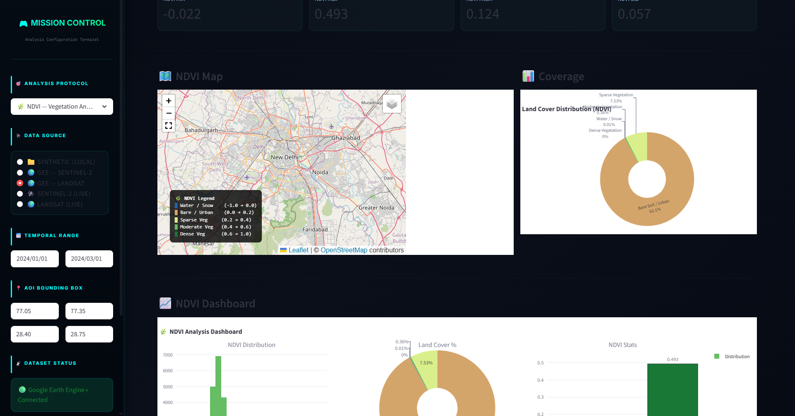
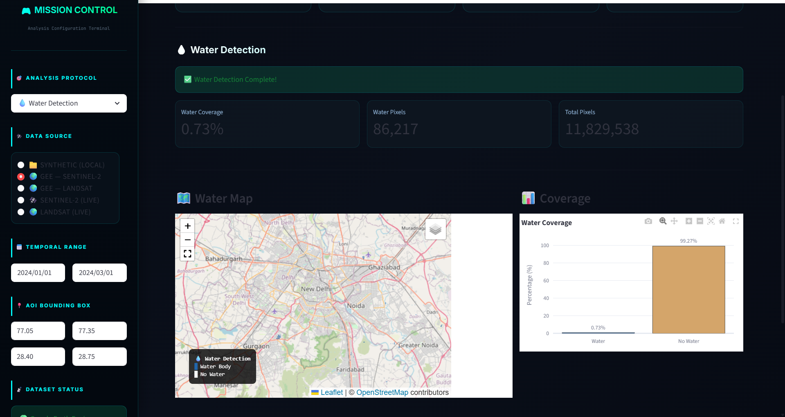

<div align="center">


<br/>

# 🛰️ EARTHLENS AI

### *Satellite Intelligence Platform*

<br/>

[](https://python.org)
[](https://streamlit.io)
[](https://earthengine.google.com)
[](https://scikit-learn.org)
[](https://python-visualization.github.io/folium)
[](LICENSE)

<br/>

> **Real-time satellite imagery. Spectral intelligence. Machine learning.**
> **Geospatial insights — built for researchers, not GIS experts.**

<br/>

[Overview](#-overview) &nbsp;•&nbsp; [Features](#-features) &nbsp;•&nbsp; [Architecture](#-architecture) &nbsp;•&nbsp; [Modules](#-analysis-modules) &nbsp;•&nbsp; [Installation](#-installation) &nbsp;•&nbsp; [GEE Setup](#-google-earth-engine-setup) &nbsp;•&nbsp; [Usage](#-usage) &nbsp;•&nbsp; [Author](#-author)

</div>

---

## 🌍 Overview

**EarthLens AI** is an end-to-end satellite data analysis platform that pulls **live imagery from Google Earth Engine**, runs spectral index computations and ML-based land cover classification, and delivers everything through a clean **Streamlit** dashboard — interactive Folium maps, Plotly charts, and real results.

No GIS software. No manual downloads. No complexity.

> *"Satellite data is no longer just for experts."*

## 📊 Platform Preview

<p align="center">
  
</p>

---

## ✨ Features

| Module | What it does | Indices |
|---|---|---|
| 🌿 **NDVI Analysis** | Vegetation health mapping & classification | NDVI |
| 💧 **Water Detection** | Water body identification & masking | NDWI, MNDWI |
| 🏙️ **Land Use Classification** | ML-powered land cover mapping | 11 spectral features |
| 🔄 **Change Detection** | Multi-temporal land cover change analysis | NDVI diff, CVA |
| 🔥 **Burn Area Detection** | Fire severity mapping (USGS standard) | NBR, dNBR |
| 🏗️ **Urban Expansion** | Urban growth tracking & vegetation loss | NDBI, UI, IBI |

**Platform highlights:**
- 🛰️ Live GEE integration — Sentinel-2 SR + Landsat 8/9
- 🤖 Three ML models — Random Forest, Decision Tree, Logistic Regression
- 🗺️ Interactive Folium maps embedded in Streamlit
- 📊 Plotly-powered charts, histograms, and class distributions
- 🧪 Offline mode using synthetic Sentinel-2 bands (no API key needed to start)

---

## 🛰️ Data Sources

| Source | Satellite | Resolution | Mode |
|---|---|---|---|
| Synthetic (Local) | Simulated Sentinel-2 | 10 m | Offline |
| GEE — Sentinel-2 | Copernicus S2 SR Harmonized | 10 m | 🔴 Live |
| GEE — Landsat | Landsat 8 / 9 SR | 30 m | 🔴 Live |
| Sentinel Hub API | Sentinel-2 | 10 m | 🔴 Live |
| USGS M2M API | Landsat | 30 m | 🔴 Live |

---

## 🏗️ Architecture
earthlens-ai-platform/
│
├── app.py                              # Streamlit entry point
├── requirements.txt
├── download_dataset.py                 # Synthetic band generator
├── README.md
│
├── earthlens_data/
│   ├── raw_imagery/                    # Synthetic Sentinel-2 bands (.tif)
│   └── processed_insights/            # Output GeoTIFFs + saved models
│
├── earthlens_core/
│   ├── analysis_engine/
│   │   ├── preprocessing.py           # Band loading, normalization, cloud masking
│   │   ├── ndvi.py                    # NDVI calc, classification, stats
│   │   ├── water_detection.py         # NDWI, MNDWI, combined water mask
│   │   ├── change_detection.py        # Image differencing, CVA
│   │   ├── burn_area.py               # NBR, dNBR, USGS severity classes
│   │   └── urban_expansion.py         # NDBI, UI, IBI, expansion mapping
│   │
│   ├── intelligence_models/
│   │   └── classifier.py              # RF + DT + LR, 11-feature engineering
│   │
│   ├── visualization_hub/
│   │   ├── map_view.py                # Folium interactive map generation
│   │   └── plots.py                   # Plotly histograms, pies, dashboards
│   │
│   └── data_pipeline/
│       ├── gee_api.py                 # Google Earth Engine integration
│       ├── sentinel_api.py            # Sentinel Hub API
│       └── landsat_api.py             # USGS M2M API
│
├── earthlens_lab/
│   └── ndvi_experiment.ipynb          # Full ML experiment notebook
│
└── earthlens_config/
└── settings.py                    # Paths, constants, configuration

---

## 🔬 Analysis Modules

### 🌿 NDVI — Vegetation Health
NDVI = (B08 - B04) / (B08 + B04)
(NIR - Red) / (NIR + Red)

| Class | NDVI Range | Interpretation |
|---|---|---|
| Water / Snow | −1.0 → 0.0 | Open water, ice, snow |
| Bare / Urban | 0.0 → 0.2 | Built-up areas, bare soil |
| Sparse Vegetation | 0.2 → 0.4 | Grassland, shrubs |
| Moderate Vegetation | 0.4 → 0.6 | Mixed forest |
| Dense Vegetation | 0.6 → 1.0 | Tropical forest, healthy crops |


---

### 💧 Water Detection
NDWI  = (B03 - B08) / (B03 + B08)    →  Open water bodies
MNDWI = (B03 - B11) / (B03 + B11)    →  Urban water (noise suppressed)

Water confirmed where **NDWI > 0 AND MNDWI > 0** — dual-index mask for higher accuracy.


---

### 🏙️ Land Use Classification

**11 features per pixel:**
Raw Bands :  B02 (Blue), B03 (Green), B04 (Red), B08 (NIR), B11 (SWIR1), B12 (SWIR2)
Indices   :  NDVI, NDWI, MNDWI, NDBI, EVI

| Model | Notes |
|---|---|
| Random Forest (100 trees) | Highest accuracy — primary model |
| Decision Tree (max depth 10) | Fast, interpretable |
| Logistic Regression | Baseline comparison |

---

### 🔄 Change Detection

| Method | Description |
|---|---|
| **NDVI Differencing** | `ΔV = NDVI_T2 − NDVI_T1` — direct vegetation change |
| **CVA** | Change Vector Analysis — magnitude + direction across NIR and Red |

Detected change types: `deforestation` · `urbanization` · `flooding`

---

### 🔥 Burn Area Detection
NBR  = (NIR - SWIR2) / (NIR + SWIR2)
dNBR = NBR_prefire  − NBR_postfire

Severity classification follows the **USGS dNBR standard:**

| Severity Class | dNBR Range |
|---|---|
| Unburned | < 0.10 |
| Low Severity | 0.10 – 0.27 |
| Moderate-Low | 0.27 – 0.44 |
| Moderate-High | 0.44 – 0.66 |
| High Severity | > 0.66 |

---

### 🏗️ Urban Expansion
NDBI = (B11 - B08) / (B11 + B08)    →  Built-up index
UI   = (B12 - B08) / (B12 + B08)    →  Urban index
IBI  = f(NDBI, NDVI, MNDWI)         →  Index-based built-up index (most accurate)

Detects new urban areas, vegetation-to-urban conversion, and urban densification over time.

---

## ⚙️ Installation

**1. Clone the repository**
```bash
git clone https://github.com/GOURGOPAL618/earthlens-ai.git
cd earthlens-ai
```

**2. Create virtual environment**
```bash
py -3.12 -m venv venv
venv\Scripts\activate          # Windows
# source venv/bin/activate     # Linux / macOS
```

**3. Install dependencies**
```bash
pip install -r requirements.txt
```

**4. Generate synthetic bands** *(offline mode — no API needed)*
```bash
py -3.12 download_dataset.py
```

**5. Launch the platform**
```bash
py -3.12 -m streamlit run app.py
```

Open `http://localhost:8501` in your browser. That's it.

---

## 🌐 Google Earth Engine Setup

> Skip this section if you want to start with synthetic data first.

**Step 1 — Create a GEE account**

Sign up at [earthengine.google.com](https://earthengine.google.com/signup/) — select **Noncommercial / Research**.

**Step 2 — Register a Cloud project**

Go to [console.cloud.google.com/earth-engine](https://console.cloud.google.com/earth-engine) and enable Earth Engine for your project.

**Step 3 — Authenticate**
```bash
py -3.12 -c "import ee; ee.Authenticate()"
```

**Step 4 — Verify**
```bash
py -3.12 -c "import ee; ee.Initialize(project='your-project-id'); print('GEE Connected ✅')"
```

**Step 5 — Set your project ID** in `earthlens_core/data_pipeline/gee_api.py`:
```python
GEE_PROJECT = "your-project-id"
```

Live data sources — **GEE Sentinel-2** and **GEE Landsat** — will now appear in the sidebar.

---

## 🚀 Usage
```bash
py -3.12 -m streamlit run app.py
```

1. Open `http://localhost:8501`
2. Pick an **Analysis Module** from the sidebar
3. Select a **Data Source** — Synthetic, GEE Sentinel-2, or GEE Landsat
4. Set **Date Range** and **Bounding Box**
5. Hit **🚀 Run Analysis**

Results: interactive map + classification overlay + statistical charts.

---

## 🧰 Tech Stack

| Layer | Technology |
|---|---|
| Dashboard | Streamlit + Folium + Plotly |
| Geospatial | Rasterio, NumPy, SciPy |
| Machine Learning | scikit-learn — RF, DT, LR |
| Satellite APIs | Google Earth Engine, Sentinel Hub, USGS M2M |
| Visualization | Matplotlib, Seaborn, Plotly |
| Experimentation | Jupyter Notebook |

---

## 📋 Requirements
streamlit
rasterio
numpy
scipy
scikit-learn
joblib
folium
streamlit-folium
plotly
matplotlib
seaborn
pandas
pillow
loguru
earthengine-api
geemap
requests

---

## 📄 License

Licensed under the **MIT License** — see [LICENSE](LICENSE) for details.

---

## 👤 Author

<div align="center">

**Gourgopal Mohapatra**
<br/>
B.Tech — Artificial Intelligence & Data Science
<br/>
*Remote Sensing · Geospatial AI · Space Technology*

<br/>

[](https://github.com/GOURGOPAL618)

</div>

---

<div align="center">

*Built with 🛰️, Python, and a deep curiosity about Earth from above.*

**EarthLens AI — Because every pixel tells a story.**

</div>
